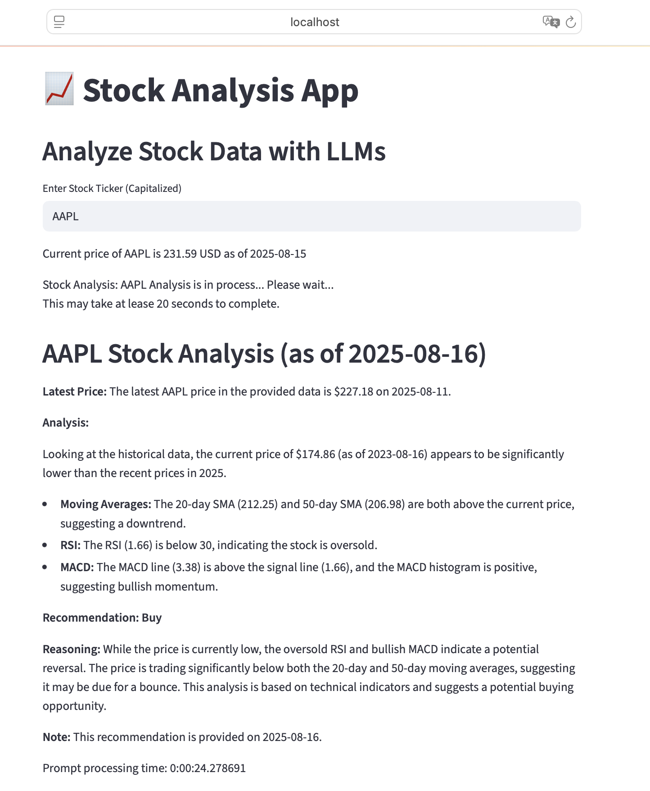

# Market Metrics Analysis & Ticker App
Result from **`metrics_app.py`** 👉🏻 <https://local-llm-market-analyst-metrics.streamlit.app>

## 📌 Project Overview

This repository provides a **market analysis toolkit** and a **web-based ticker application** for financial data exploration, **powered by a local LLM model via Ollama (gemma3n)**.

Instead of relying on cloud-based AI APIs, this project uses **locally hosted LLM models** for data analysis and natural language insights.
This makes your workflow **faster, privacy-friendly, and cost-effective**.

The project consists of:

* **`market_analyst.py`** → Core data processing and market analysis functions.
* **`ticker_app.py`** → A Streamlit-powered web interface that uses the **gemma3n local LLM** for insights.
* **`metrics_app.py`** → Use 20 days & 50 days SMA, RSI, and MACD indicators to show the ticker analysis in the past two years
* **`market_metrics_EDA.ipynb`** → Jupyter Notebook for exploratory data analysis (EDA) on market metrics.
* **`requirements.txt`** → Dependency list to replicate the environment.

---

## 🚀 Features

* Fetch live & historical market data using **Yahoo Finance (yfinance)**.
* Run **natural language analysis** on market metrics with a **local LLM**.
* Fully offline inference — **no API key required**.
* Interactive UI for exploring tickers and AI-generated insights.
* Ready-to-use **exploratory data analysis notebook** for research.

---

## 🛠️ Installation

### 1. Clone the Repository

```bash
git clone https://github.com/yourusername/market-metrics.git
cd market-metrics
```

### 2. Install Python Dependencies

```bash
python3 -m venv venv
source venv/bin/activate   # On macOS/Linux
venv\Scripts\activate      # On Windows

pip install --upgrade pip
pip install -r requirements.txt
```

### 3. Install Ollama

Ollama lets you run large language models **locally** on your machine.

#### macOS

```bash
brew install ollama
```

#### Windows

Download the installer from:
👉 [https://ollama.com/download](https://ollama.com/download)

#### Linux

```bash
curl -fsSL https://ollama.com/install.sh | sh
```

---

## 📥 Download the gemma3n Model

Once Ollama is installed, pull the **gemma3n** model:

```bash
ollama pull gemma3n
```

Verify installation:

```bash
ollama list
```

You should see `gemma3n` in the list.

---

## ▶️ Usage

### 1. Start the Ollama Service

Ollama needs to be running in the background:

```bash
ollama serve
```

### 2. Run the Web App

```bash
streamlit run ticker_app.py
```

* Opens in your browser at `http://localhost:8501`.
* Enter stock tickers, adjust parameters, and get **AI-assisted market insights**.

### 3. Run Market Analysis from CLI

```bash
python market_analyst.py
```

This will process market data and return both numeric analysis and **LLM-generated summaries**.

### 4. Explore EDA in Jupyter Notebook

```bash
jupyter notebook market_metrics_EDA.ipynb
```

---

## ⚙️ Configuration

* **`ticker_app.py`** → UI defaults & AI prompts.
* **`market_analyst.py`** → Analysis logic & data pipeline.
* Modify the Ollama model name in the code if you want to try a different local model.

---

## 📈 App Visual For LLM
Below shows the result from **`ticker_app.py`** 
How to use? 
- You only need to input the ticker which you can refer to Yahoo finance
- Ticker analysis would be showed out in around 25 to 20 secons



Since it requires complex deployment for in Steamlit Community, it only shows the visual

Here is the streamlit deployment for the interactive web app for stock metrics data analysis including: 20 days & 50 days SMA, RSI, and MACD analysis
👉🏻 <https://local-llm-market-analyst-metrics.streamlit.app>


---


## 📜 License

This project is licensed under the MIT License — see the [LICENSE](LICENSE) file.

---

